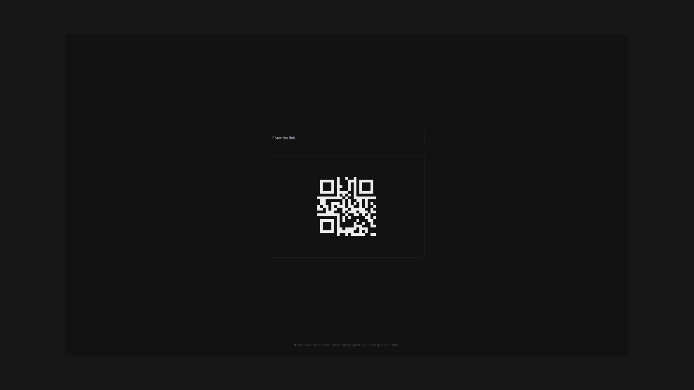

## Overview

A project where we turn links into QR codes. It was created using React and Tailwindcss technologies.

- `/` - Home page.

## Built With

- [React](https://reactjs.org)
- [Tailwind CSS](https://tailwindcss.com)
- [QR Code Package](https://www.npmjs.com/package/react-qr-code)

## Running Locally

```bash
$ git clone https://github.com/baranadali/qrgenerate
$ cd qrgenerate
$ npm install
$ npm run dev
<<<<<<< HEAD
```
=======
```
>>>>>>> 77e192d (QR code download feature has been activated.)
